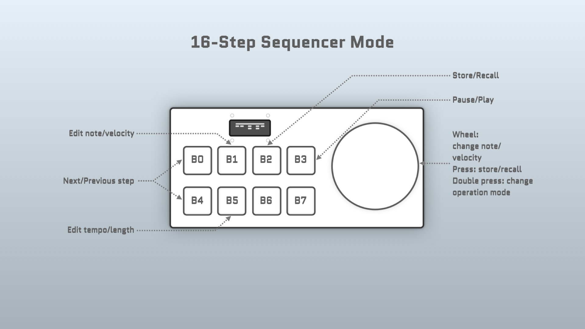

# CTRLR MIDI Controller

A programmable MIDI Controller

## Hardware

- [Teensy 4.0](https://www.pjrc.com/store/teensy40.html)
- [Adafruit SSD1306 128x32 display](https://www.adafruit.com/product/661)
- 8 pushbuttons (from [Anchor Electronics](https://anchor-electronics.com/))
- A rotary encoder
- 3D-printed enclosure, buttons caps, and rotary wheel

### Enclosure

The [enclosure](/enclosure) was designed with [Solvespace](https://solvespace.com/), a parametric 3D CAD tool. The button pads and dial were designed with [OpenSCAD](http://www.openscad.org/).

#### Top

#### Bottom

## Installation with Arduino

### Arduino

Install [Arduino](https://www.arduino.cc/en/software) 2.0+.

### Teensyduino

Follow [these instructions](https://www.pjrc.com/teensy/td_download.html) to install the Teensyduino add-on. ([board manager url](https://www.pjrc.com/teensy/package_teensy_index.json))

Then to use the Teensy 4.0 board, in the Arduino menu select `Tools -> Board -> Teensy -> Teensy 4.0`.

### Adafruit libraries

To use the SSD1306 display, these libraries need to be installed in Arduino. For newer versions, just search for and install the display type in the Arduino library manager (`"Adafruit SSD1306"` for this project), and the required dependencies (notably Adafruit GFX Library & Adafruit BusIO Library) will be installed with it.

- [Adafruit GFX Graphics Library](https://learn.adafruit.com/adafruit-gfx-graphics-library/overview)
- [Adafruit SSD1306](https://github.com/adafruit/Adafruit_SSD1306)

### Project Dependencies

Clone these repositories:

- [buttoner](https://github.com/andypayne/buttoner)
- [midi_defs](https://github.com/andypayne/midi_defs)

## Pure Data integration

Objects for [Pure Data](https://puredata.info/) are located in [/PureData](/PureData).

### ctrlr.pd

### ctrlr_test.pd

## Operation Modes

### 16-Step Sequencer

## Issues

### Enclosure

The enclosure had several issues, most of which would be fixed in a second revision. I haven't done this yet, partially due to the difficulty and cost of printing another revision.

- _Material_ - The 3D-printed material is a bit too brittle for this application.
- _Height_ - The enclosure is unnecessarily tall, due to my poor planning. I think it gives the device a clunky 70s feel.
- _Support columns_ - I didn't properly attach these to the base in Solvespace, so most of them separated after printing.
- _Button travel_ - The button switches I used have too much travel for this application. I was determined to use these particular switches for some inexplicable reason.
- _Access to reset_ - The access to the reset button requires disassembling the enclosure, which is not ideal when making mistakes while developing code for the device.
- _Piece fit_ - I made an error in Solvespace when designing the fit mechanism for the top and bottom pieces, so I had to use screws to attach the pieces. This makes the device more fragile.
- _USB port_ - I didn't account for the USB port in my enclosure design, so I had to drill/route a hole for it.

### Screen

- _Size_ - The screen size is too small. The positive benefit of this is that it provided a constraint that required some creativity to overcome with some of the modes. It was an interesting challenge to fit the right details on the available screen real estate.
- _Asymmetry_ - I didn't pay close attention to the screen asymmetry when designing the enclosure cutout for it. The screen sits to one side of the cutout.
- _Screen fit_ - I mis-measured the mounting layout for the screen, so the resulting mount on the enclosure is the wrong size, and so the mounted screen causes the enclosure to bow out a little.
- _Screen connectors_ - I didn't properly account for the screen's header pins and connectors header pin connectors when laying out the enclosure, so I had to refit them, and cut out a section of my stripboard to accommodate.

